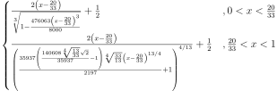

# AgX

> Minimal AgX in GLSL, **WITHOUT LUT**.

## INTRODUCTION

Agx is a tone mapping transform that improves on Filmic, giving more photorealistic results. AgX offers 16.5 stops of dynamic range and unsaturates highly exposed colors to mimic film’s natural response to light[[1]](https://docs.blender.org/manual/en/latest/render/color_management.html).  

[Original AgX](https://github.com/sobotka/AgX) work with an 1D LUT which Length = 4096. It's too heavy for me. There are also some derived version use polynomial to fitting that LUT. However, it is evident that this will introduce errors. So I found the generation code for LUT and trying to understand the algorithm behind AgX. This process is not pleasant, because AgX use tunable sigmoid function and hundreds of lines of code to structure the tone mapping curve. But there are still traces to follow.  

<!-- too large to render
$$
\begin{cases}
\frac{2 \left(x-\frac{20}{33}\right)}{\sqrt[3]{1-\frac{476063 \left(x-\frac{20}{33}\right)^3}{8000}}}+\frac{1}{2}&,0<x<\frac{20}{33}\\
\frac{2 \left(x-\frac{20}{33}\right)}{\left(\frac{35937 \left(\frac{140608 \sqrt[4]{\frac{13}{33}} \sqrt{2}}{35937}-1\right) \sqrt[4]{\frac{33}{13}} \left(x-\frac{20}{33}\right)^{13/4}}{2197}+1\right)^{4/13}}+\frac{1}{2}&,\frac{20}{33}<x<1
\end{cases}
$$
-->

So, This is the analytical formula of AgX. This is not an approximate value, but an exact value. The complexity of expressions mainly comes from coefficients, and the computational cost in real-time rendering is actually acceptable (At least better than a lookup table). The coefficients have been calculated as machine precision floating-point numbers, some of them came from original AgX, some of them, some of them were calculated by me using Wolfram Mathematica. The significant digits of all coefficients exceed single precision floating-point numbers.  

## TODO
1. The code was not optimized, and I tried to eliminate branches, but it caused it to not work properly. I'll deal with it when I have free time, not now.
2. LookTransform: "Golden", "Punchy"